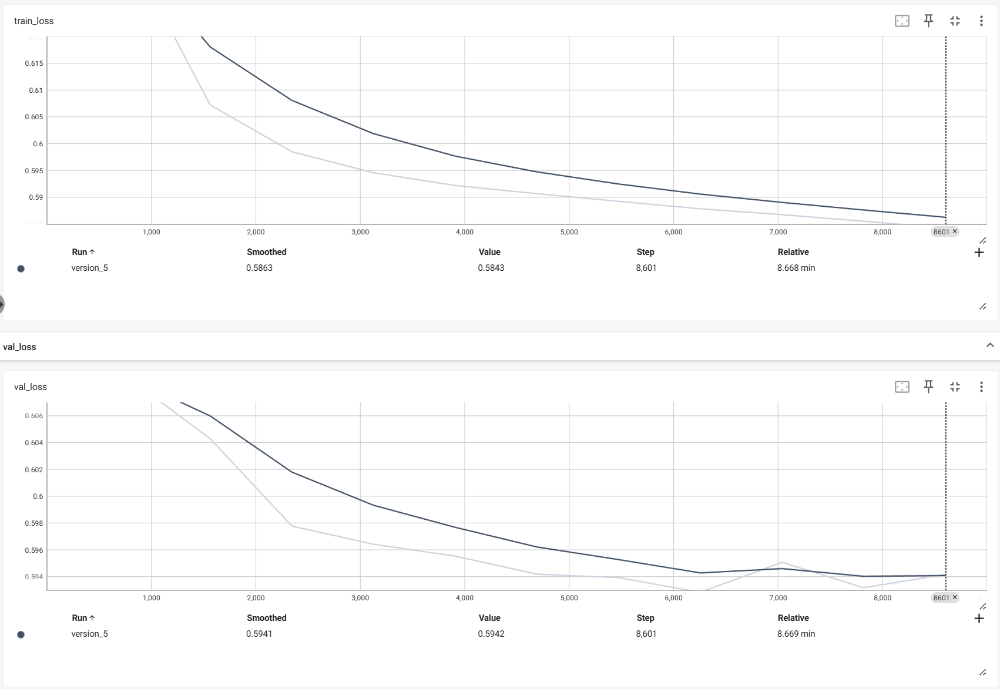

# 📌 DSSM Tower Model for Recommendation

## 🔍 Introduction
This repository implements a DSSM (Deep Structured Semantic Model) with **tower architecture** using PyTorch Lightning. The model is trained to learn semantic representations of users and items for recommendation or matching tasks.

---

## 📦 Features

- Dual-tower DSSM architecture (user tower + item tower)
- Embedding for sparse features (e.g., gender, age, occupation, genres)
- MLP layers with dropout for regularization
- Loss: `BCEWithLogitsLoss`
- AUC, accuracy, and loss metrics for training/validation/testing
- PyTorch Lightning for cleaner training loop and logging

---

## 📁 Dataset

This implementation works with datasets like **MovieLens 1M** or any custom user-item interaction dataset.

Each sample contains:
- User features: `gender`, `age`, `occupation`
- Item features: `genre`, `title` 
- Label: binary 

---

## 🛠️ Requirements

```bash
pip install pytorch_lightning
```

---

## 🚀 Training

```bash
python main.py
```
---

## 📈 Performance
| Metric  | Value  |
|---------|--------|
| Training loss | 0.584 |
| Val loss | 0.594 |




---

## 🧪 Test Results

| Metric  | Value  |
|---------|--------|
| Test Loss | 0.594 |
| Test AUC | 77.84% |
| Test ACC | 71.61% |


