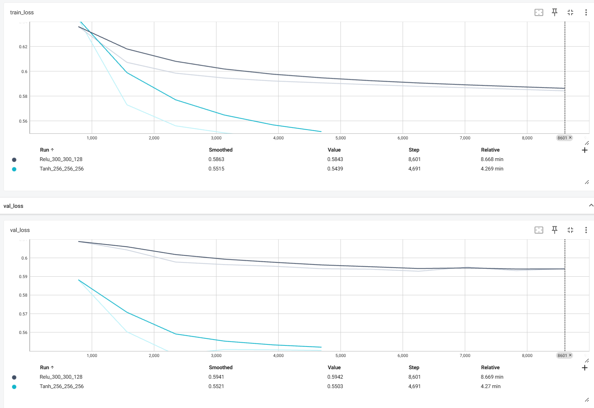

# 📌 DSSM Tower Model for Recommendation

## 🔍 Introduction
This repository implements a DSSM (Deep Structured Semantic Model) with **tower architecture** using PyTorch Lightning. The model is trained to learn semantic representations of users and items for recommendation or matching tasks.

---

## 📦 Features

- Dual-tower DSSM architecture (user tower + item tower)
- Embedding for sparse features (e.g., gender, age, occupation, genres)
- Each movie can have up to 6 genres, represented as a vector [g1, g2, g3, g4, g5, g6] — if any are missing, they will be padded with 0. Using mean pooling to combine the 6 genre embeddings into one vector.
- MLP layers with dropout for regularization
- Loss: `BCEWithLogitsLoss`
- AUC, accuracy, and loss metrics for training/validation/testing
- PyTorch Lightning for cleaner training loop and logging

---

## 📁 Dataset

This implementation works with datasets like **MovieLens 1M** or any custom user-item interaction dataset.

Each sample contains:
- User features: `gender`, `age`, `occupation`
- Item features: `genre`, `title` 
- Label: binary 

---

## 🛠️ Requirements

```bash
pip install pytorch_lightning
```

---

## ⚖️ Comparison of MLP Structures

Here are some comparision between four model structures

---

### 🧱 Structure ReLU (w mlp[300, 300, 128]) model

```python
Sequential(
  (0): Linear(in_features=256, out_features=300, bias=True)
  (1): ReLU()
  (2): Dropout(p=0.2, inplace=False)
  (3): Linear(in_features=300, out_features=300, bias=True)
  (4): ReLU()
  (5): Dropout(p=0.2, inplace=False)
  (6): Linear(in_features=300, out_features=128, bias=True)
  (7): ReLU()
  (8): Dropout(p=0.2, inplace=False)
)
Sequential(
  (0): Linear(in_features=128, out_features=300, bias=True)
  (1): ReLU()
  (2): Dropout(p=0.2, inplace=False)
  (3): Linear(in_features=300, out_features=300, bias=True)
  (4): ReLU()
  (5): Dropout(p=0.2, inplace=False)
  (6): Linear(in_features=300, out_features=128, bias=True)
  (7): ReLU()
  (8): Dropout(p=0.2, inplace=False)
)
```

### 🧱 Structure Tanh (w mlp[256, 256, 256]) model

```python
Sequential(
  (0): Linear(in_features=256, out_features=256, bias=True)
  (1): Tanh()
  (2): Dropout(p=0.2, inplace=False)
  (3): Linear(in_features=256, out_features=256, bias=True)
  (4): Tanh()
  (5): Dropout(p=0.2, inplace=False)
  (6): Linear(in_features=256, out_features=256, bias=True)
  (7): Tanh()
  (8): Dropout(p=0.2, inplace=False)
)
Sequential(
  (0): Linear(in_features=128, out_features=256, bias=True)
  (1): Tanh()
  (2): Dropout(p=0.2, inplace=False)
  (3): Linear(in_features=256, out_features=256, bias=True)
  (4): Tanh()
  (5): Dropout(p=0.2, inplace=False)
  (6): Linear(in_features=256, out_features=256, bias=True)
  (7): Tanh()
  (8): Dropout(p=0.2, inplace=False)
)
```

### 🧱 Structure Tanh (w mlp[256, 256, 256] and xavier_normal_ )  model - Dropout **After** Tanh Activation

```python
Sequential(
  (0): Linear(in_features=256, out_features=256, bias=True)
  (1): BatchNorm1d(256, eps=1e-05, momentum=0.1, affine=True, track_running_stats=True)
  (2): Tanh()
  (3): Dropout(p=0.2, inplace=False)
  (4): Linear(in_features=256, out_features=256, bias=True)
  (5): BatchNorm1d(256, eps=1e-05, momentum=0.1, affine=True, track_running_stats=True)
  (6): Tanh()
  (7): Dropout(p=0.2, inplace=False)
  (8): Linear(in_features=256, out_features=256, bias=True)
  (9): BatchNorm1d(256, eps=1e-05, momentum=0.1, affine=True, track_running_stats=True)
  (10): Tanh()
  (11): Dropout(p=0.2, inplace=False)
)
Sequential(
  (0): Linear(in_features=128, out_features=256, bias=True)
  (1): BatchNorm1d(256, eps=1e-05, momentum=0.1, affine=True, track_running_stats=True)
  (2): Tanh()
  (3): Dropout(p=0.2, inplace=False)
  (4): Linear(in_features=256, out_features=256, bias=True)
  (5): BatchNorm1d(256, eps=1e-05, momentum=0.1, affine=True, track_running_stats=True)
  (6): Tanh()
  (7): Dropout(p=0.2, inplace=False)
  (8): Linear(in_features=256, out_features=256, bias=True)
  (9): BatchNorm1d(256, eps=1e-05, momentum=0.1, affine=True, track_running_stats=True)
  (10): Tanh()
  (11): Dropout(p=0.2, inplace=False)
)
```

### 🧱 Structure Tanh (w mlp[256, 256, 256] and xavier_normal_ )  model - Dropout **Before** Linear Layer 

```python
Sequential(
  (0): Dropout(p=0.3, inplace=False)
  (1): Linear(in_features=256, out_features=256, bias=True)
  (2): BatchNorm1d(256, eps=1e-05, momentum=0.1, affine=True, track_running_stats=True)
  (3): Tanh()
  (4): Dropout(p=0.3, inplace=False)
  (5): Linear(in_features=256, out_features=256, bias=True)
  (6): BatchNorm1d(256, eps=1e-05, momentum=0.1, affine=True, track_running_stats=True)
  (7): Tanh()
  (8): Dropout(p=0.3, inplace=False)
  (9): Linear(in_features=256, out_features=256, bias=True)
  (10): BatchNorm1d(256, eps=1e-05, momentum=0.1, affine=True, track_running_stats=True)
  (11): Tanh()
)
Sequential(
  (0): Dropout(p=0.3, inplace=False)
  (1): Linear(in_features=128, out_features=256, bias=True)
  (2): BatchNorm1d(256, eps=1e-05, momentum=0.1, affine=True, track_running_stats=True)
  (3): Tanh()
  (4): Dropout(p=0.3, inplace=False)
  (5): Linear(in_features=256, out_features=256, bias=True)
  (6): BatchNorm1d(256, eps=1e-05, momentum=0.1, affine=True, track_running_stats=True)
  (7): Tanh()
  (8): Dropout(p=0.3, inplace=False)
  (9): Linear(in_features=256, out_features=256, bias=True)
  (10): BatchNorm1d(256, eps=1e-05, momentum=0.1, affine=True, track_running_stats=True)
  (11): Tanh()
)
```

---

## 🚀 Training

```bash
python main.py
```
---

## 📈 Performance (best results are in bold)
| Model  | Training Loss  | Val Loss |
|--------|----------------|----------|
| ReLU (w mlp[300, 300, 128]) | 0.588 | 0.593 |
| Tanh (w mlp[256, 256, 256]) | **0.556** | **0.548** |

### ReLU (w mlp[300, 300, 128]) model


### Tanh (w mlp[256, 256, 256]) model


## Comparision


---

## 🧪 Test Results (best results are in bold)
| Model  | Test Loss | Test AUC | Test ACC |
|--------|-----------|----------|----------|
| ReLU (w mlp[300, 300, 128]) | 0.594 | 77.84% | 71.61% |
| Tanh (w mlp[256, 256, 256]) | **0.550** | **79.51%** | **73.04%** |

### ReLU (w mlp[300, 300, 128]) model


### Tanh (w mlp[256, 256, 256]) model

